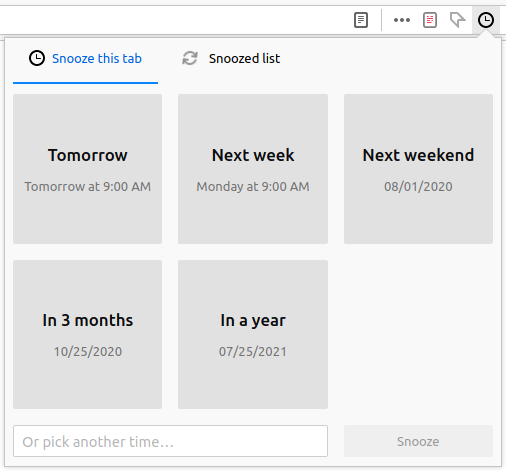
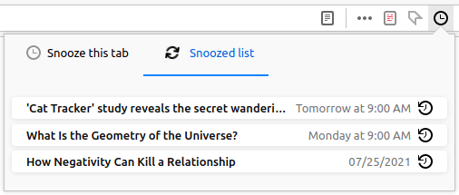

#  [Snooze Pocket](https://addons.mozilla.org/en-US/firefox/addon/snooze-pocket/) — links for later

Are you an avid user of [Pocket](https://getpocket.com/)? Then you probably have
those dozen links at the bottom of your list that have been there forever!

Maybe it's for a concert that hasn't started selling tickets yet. Maybe it's
stuff to do for when your friend is coming to visit you. Maybe it's stuff about
a new hobby that you don't have the time for right now.

Whatever they are, if those “bottom links” bother you, _Snooze Pocket_ is the
Firefox extension for you!

## How do I use this?

After
[installing the extension](https://addons.mozilla.org/en-US/firefox/addon/snooze-pocket/)
on your Firefox, you will be asked to log in with Pocket. Once you approve the
extension, click on the  clock icon in the location
bar, and select a time to snooze the current tab.

The “Snoozed list” tab in the extension lets you see all of your existing
snoozed links and lets you unsnooze them immediately.

Links will automatically show up at the top of your Pocket app when it's time.
For this to happen, Firefox has to be open and the extension installed and
active.

### How does it work?

Behind the scenes, the extension simply adds the links to your Pocket account
and immediately archives them with a
[`snoozed`](https://app.getpocket.com/tags/snoozed/all) tag. The extension
itself saves the time it should re-add the link (un-archive), and syncs that
information with your [Firefox Account](https://accounts.firefox.com/), if you
use one and allow it to sync extension data (Firefox Preferences → Sync).

Because the links are in your Pocket account and are tagged, you can always
safely remove this extension and still find all of the links that you meant to
read later!

## Privacy

_Snooze Pocket_ respects your privacy! The extension does not collect any data
on you. All of your data stays between you, your Firefox, and your Pocket
account.

## Contributions welcome!

I'm developing this extension in my free time. Saying that, please report any
issues and feature requests here on GitHub, or send me pull requests, and I'll
try to get back to you as soon as possible!

Another way to contibute is to help with translations. This just means copying
the [messages.json](src/_locales/en/messages.json) file into another directory
under [src/\_locales](src/_locales) with your language (or language and region)
code. See MDN's documentation on
[Internationalization](https://developer.mozilla.org/en-US/docs/Mozilla/Add-ons/WebExtensions/Internationalization#Providing_localized_strings_in__locales)
for details.

## License and credits

_Snooze Pocket_ is licensed under an [ISC license](LICENSE).

_Snooze Pocket_ uses the following software and media:

- [Day.js](https://day.js.org/) — Copyright © 2018
  [iamkun](https://github.com/iamkun)
  ([MIT License](https://github.com/iamkun/dayjs/blob/dev/LICENSE))
- [flatpickr](https://flatpickr.js.org/) — Copyright © 2017
  [Gregory Petrosyan](https://github.com/chmln)
  ([MIT License](https://github.com/flatpickr/flatpickr/blob/master/LICENSE.md))
- [Photon Icons](https://github.com/FirefoxUX/photon-icons) — Copyright © 2018
  [Mozilla](https://www.mozilla.org/en-CA/)
  ([MPL-2.0 License](https://github.com/FirefoxUX/photon-icons/blob/master/LICENSE))
- [photon-components-web](https://github.com/FirefoxUX/photon-components-web) —
  Copyright © 2018 [Mozilla](https://www.mozilla.org/en-CA/)
  ([MPL-2.0 License](https://github.com/FirefoxUX/photon-icons/blob/master/LICENSE))
